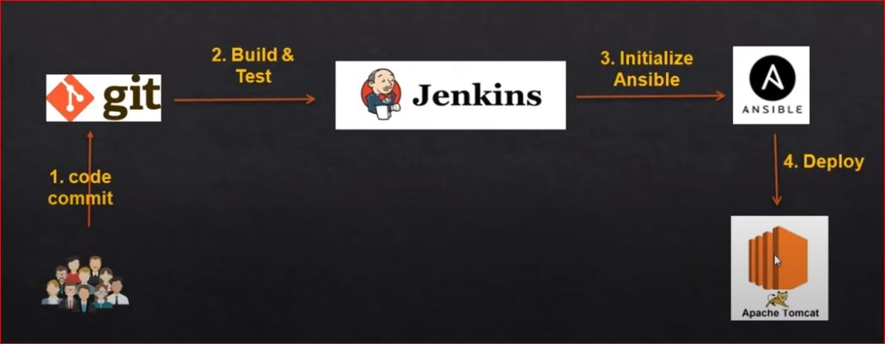
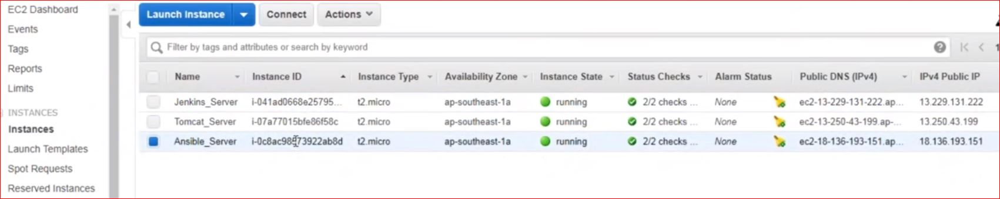

## **CI/CD Pipeline Using GIT, Jenkins and Ansible**
---
In this project, I build the application using Jenkins and deploy to our webserver using Ansible

Project Diagram:

### **STATEMENT PROBLEM**
---
#### **Scenario :**
The company is building an application. The developers want to deploy the appication into a webserver Tomcat and show it to the Business heads.

I was tasked to 
- Create the jenknis server, install the necessay plugins, 
- Configure the jenkins with Git to fetch the code from the repo, 
- Build the applications and deploy it to the webserver using Ansible.

### **STEPS PERFORM**
---
- Enable password less authentication b/w Ansible and Tomcat server.

- Install "Publish over ssh" plugins on the jenkins server

- Write a playbook to copy jar/war file on to tomcat server.

- Modify Jenkins Job to copy artifacts and inititiate ansible playbook.  

### **Servers**
---
I Launch 3 Ec2 instance:
- 1 For Jenkins Servers
- 1 For Tomcat Server
- 1 For Ansible Server 

